# Reasonable Planning AI

Discuss the future of this project with us in real time on our [Discord](https://discord.com/invite/Tv7uMsMh).

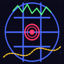

Create an AI that can think for itself and plan a series of actions using only a data driven Editor. Your players will be astounded by the smart responsiveness of the AI to your game environment and marvel at it's ability to adapt and act on the fly!

Reasonable Planning AI is a drop in solution to provide a robust design and data driven AI that thinks for itself and plans it's actions accordingly. One can create AI with no Blueprints nor C++. Reasonable Planning AI acheives this through the Reasonable Planning AI Editor. A robust Unreal Engine editor that lets you predefine a set of actions, a set of goals, and a state. All logic is achieved through the use of various data driven constructs. These components put together are known as Reasonable Planning AI Composer.

Reasonable Planning AI is also extensible using either Blueprints or C++. You can opt to extend composer with custom `RpaiComposerActionTasks` or go a pure code route and implement the Core Rpai components.

Reasonable Planning AI is also cross-compatible with Behavior Trees and can execute AITasks. It also comes with an extension to integrate Composer designed Reasonable Planning AI into an existing Behavior Tree through a pre-defined BTTask node within the plugin.

Reasonable Planning AI utilizes the visual logger for easier debugging of your AI. Reasonable Planning AI Editor also has a builtin hueristics testing tool. You can define a given starting state, and ending desired state, and visual the goal the AI will select under those conditions as well as the action plan it will execute.

## Design of Reasonable Planning AI

The core design of the Reasonable Planning AI when using the Core components and the Core RpaiBrainComponent follows a very simple path of execution. This path of execution is illustrated in the below flow chart.

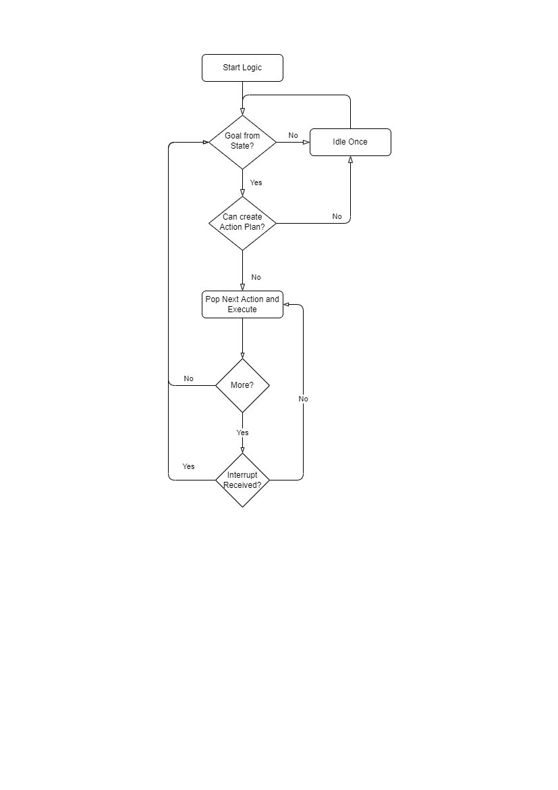

Text description of the above flowchart. A Start Logic method is invoked. A goal is selected, determined by the current state. If a goal is not determined, then the AI will idle once, else the goal defines it's desired state and it is applied to a planner used to determine an action plan. If a plan is not able to be formulated, then it will attempt a new evaluation of a desired goal. If a plan is found, it will continue to execute the plan until there are no more actions available within the plan or a command to interrupt the execution of the plan is received. After any of those exit conditions, a goal is determined from a current state and the process repeats.

There are two layers to the Reasonable Planning AI that make it a robust AI solution for your project. These layers are known as **Core** and **Composer**.

### Core

There are five (5) Core components implementing Reasonable Planning AI that builds the foundation of the plugin.

- RpaiGoalBase
- RpaiActionBase
- RpaiPlannerBase
- RpaiReasonerBase
- RpaiBrainComponent

The main execution engine for Reasonable Planning AI is the `RpaiBrainComponent`. This is a `UBrainComponent` from the `AIModule` used to execute AI logic and interact with the rest of the `AIModule` defined components. The two logic driving classes are `RpaiRpaiReasonerBase` and `RpaiRpaiPlannerBase`. The `RpaiRpaiReasonerBase` class is used to provide implementations for determining goals. Out of the box, there are two implementations provided `RpaiReasoners/RpaiRpaiReasoner_DualUtility` and `RpaiReasoners/RpaiRpaiReasoner_AbsoluteUtility`. Please read the documentation of each class to understand thier capabilities. For goal reasoning there is one provided solution. This solution is `RpaiPlanners/RpaiRpaiPlanner_AStar`. This implementation determines an action plan by using the `RpaiGoalBase::DistanceToCompletion` and `RpaiActionBase::ExecutionWeight` functions for the cost heuristic.

`RpaiGoalBase` and `RpaiActionBase` are the classes most developers will implement when not using Composer classes to build a data drive AI within the editor. `RpaiGoalBase` provides functions for determining value (commonly referred to as utility) for a given desired outcome. It also provides functions for determining the effort to accomplish the given goal from a given current state. `RpaiActionBase` provides functions for heuristics to calculate the effort to do an action given a state. It also provides methods for execution. These execution methods are the primary drivers for having the AI act. These functions are similar to the UE baked in AI `BTTasks`.

### Composer

The Composer layer is built on top of the Core layer of Reasonable Planning AI. Composer brings the value of Reasonable Planning AI to Game Designers and others without needing to wire Blueprints or write C++. Because Composer is built on top of Core, any Programmers will be able to intergrate into the Composer framework by simply by inheriting from one of the Core classes or from the extend Composer defined classes. The Composer defined classes are listed below.

- RpaiComposerGoal
- RpaiComposerAction
- RpaiComposerBrainComponent
- RpaiComposerActionTask
- RpaiComposerActionTaskBase
- RpaiComposerStateQuery
- RpaiComposerStateMutator
- RpaiComposerDistance
- RpaiComposerWeight
- RpaiComposerBehavior

The relationship of these classes to each other are defined below. For additonal details please refer to the documentation of the classes either in the Unreal Engine Editor or C++ comments. Ultimately the classes are used to configure data queries to provide cost, weight, applicability, and mutations during the goal selection and action planning processes. `RpaiActionTasks` are predefined actions your AI can do within the game world. `RpaiComposerBrianComponent` is an extension of `RpaiBrainComponent` that adds a factory method to create goals and actions plans from the defined `RpaiComposerBehavior` data asset.

- RpaiComposerGoal
  - RpaiStateQuery
  - RpaiComposerDistance
  - RpaiComposerWeight

- RpaiComposerAction
  - RpaiComposerStateQuery
  - RpaiComposerWeight
  - RpaiComposerStateMutator
  - RpaiComposerActionTask

- RpaiComposerBehavior
  - RpaiComposerAction[]
  - RpaiComposerGoal[]
  - RpaiState: SubclassOf

- RpaiComposerBrainComponent
  - RpaiComposerBehavior

To start using Reasonable Planning AI Composer within the Editor, simply create a new DataAsset within your Content folder and select the type RpaiCmposerBehavior. From there you will be able to define and configure your new AI! See below for a simple tutorial.

## Versioning

Reasonable Planning AI releases are versioned. In source code they are tagged commits. The versioning follows the below format (akin to Semantic Versioning)

**major.minor.patch-d.d-{alpha|beta|gold}**

The first tuple of `major.minor.patch` is the Reasonable Planning AI version. Explanations of the numbers are as below:

> *major* Breaking changes were introduced, significant changes to the behavior of functions, and deprecated functions and fields have been removed.

> *minor* New fields or functions were added. Some fields or functions may be marked as deprecated. No breaking changes introduced.

> *patch* Bug fixes, no new field additions or functions introduced. May have a change in behavior.

The second tuple of `d.d` is the version of Unreal Engine this release is compatible with. This means there could be multiple versions of Reasonable Planning AI to indicate UE compatibility.

The last part is the `{alpha|beta|gold}` indicating the stability of the release. 

> *alpha* builds **DO NOT** honor the `major.minor.patch` promises of changes. These releases compile and pass all tests. Releases marked as `alpha` can be dramatically different in between versions and upgrades are not advised. DO NOT use alpha for your game project or product.

> *beta* builds are stable releases that are anticapted to be upgraded to `gold`. They meet all requirements and are fully featured. Breaking changes are not anticpated and beta builds will honor the versioning promises.

> *gold* A production release. Fully featured and ready to go. May be up on the Marketplace (pending approval)

## Quick Start Tutorial AI

You can give Reasonable Planning AI a quick try by configuring a simple AI by following the steps below. The simple AI will have a goal to move towards a target location and an action that involves having the AI walk to that target location. When a Reasonable Planning AI is designed with a 1:1 Goal to Action design, it is the equivalent of creating a Utility AI. This is what this tutorial will create.

> This works for both Unreal Engine 4.27.2 and Unreal Engine 5.0.2. Screenshots are taken in UE5, but the workflow is the same with the exception of step 1.a where the Place Actors window should already be open in 4.27.2.

- Create a New Project (Third Person C++) with Starter Content or open an existing project and create a new Basic world with Navigation
- In your project select New -> Level. In the dialogue select "Basic".
- Place a Navigation Volume from the "Place Actors" panel. If you do not see it, open by selecting Window -> Place Actors. Search for "Nav" and drag and drop "NavMeshBoundsVolume" into the Level Viewport.

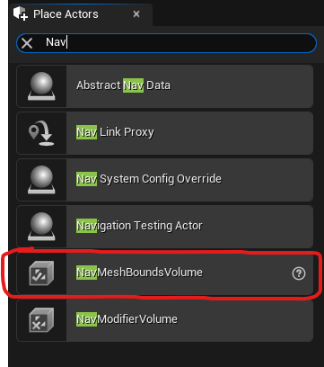

- Set Location to 0,0,0
- Set the Brush X and Y values to 10000.0 and the Z value to 1000.0

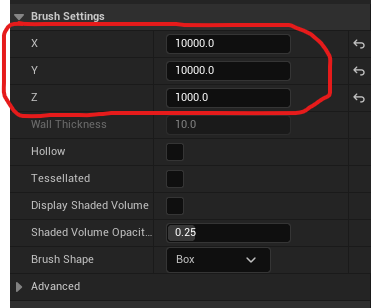

- To confirm navigation covers the floor, press `P` to visualize the NavMesh. It should have a green overlay.

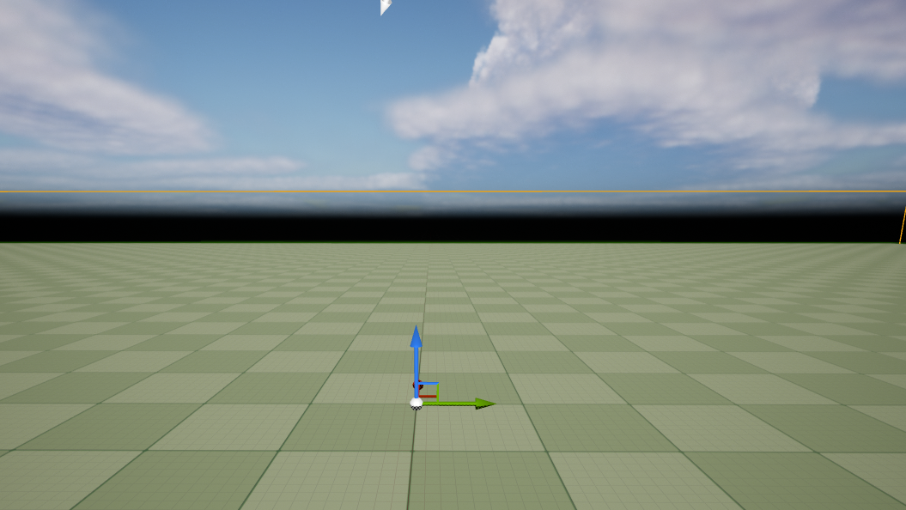

- Create an `RpaiComposerBehavior`
- Right click your Content Browser drawer and select Miscelaneous > Data Asset

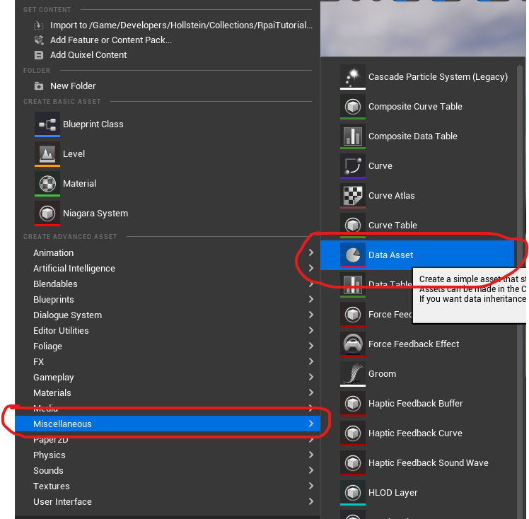

- Search for "Rpai" and select `RpaiComposerBehavior`

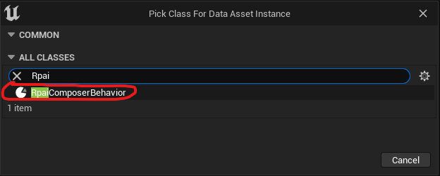

- Configure your newly named Composer Behavior
- For the `ConstructedStateType` select `RpaiState_Map`
- For the `Reasoner` select `Rpai Reasoner Dual Utility`
- For the `Planner` select `Rpai Planner AStar`

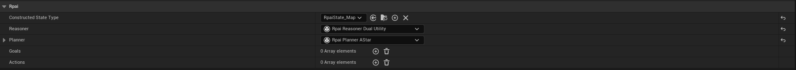

- Add a Goal by clicking the plus sign to the right of the `Goals` field.

> Note within Rpai Vector to Vector comparisons are done via the squared value of the distance between the two vectors. `FVector::DistSquared`.

- Select the arrow to the left of `Index [ 0 ]`
- For `Distance Calculator` select `Rpai Distance State`. Select the arrow to the left to expand details if necessary, also expand the Rpai details if necessary.
- For `Right Hand Side State Reference Key`, expand details and set `State Key Name` to "CurrentLocation" and `Expected Value Type` to "Vector"
- For `Left Hand Side State Reference Key`, expand details and set `State Key Name` to "TargetLocation" and `Expected Value Type` to "Vector"

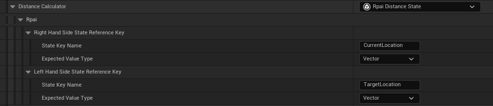

- For `Weight` select `Rpai Weight Distance`. Select the arrow to the left to expand details if necessary, also expand the Rpai details if necessary.
- For `Distance` select `Rpai Distance State`. Select the arrow to the left to expand details if necessary, also expand the Rpai details if necessar
- For `Right Hand Side State Reference Key`, expand details and set `State Key Name` to "CurrentLocation" and `Expected Value Type` to "Vector"
- For `Left Hand Side State Reference Key`, expand details and set `State Key Name` to "TargetLocation" and `Expected Value Type` to "Vector"

> Because there are no other goals configured in this tutorial, the Weight is somewhat of a throw away configuration. Ideally, the weight of a goal represents the value of choosing this goal.

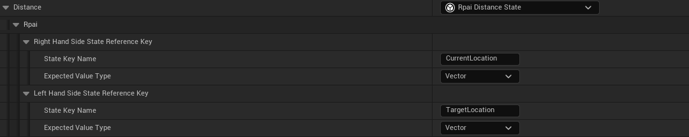

- For `Is Applicable Query` select `Rpai State Query Compare Distance Float`. Select the arrow to the left to expand details if necessary, also expand the Rpai details if necessary.
- For `Comparison Operation` select "Greater Than"
- For `Distance` select `Rpai Distance State`. Select the arrow to the left to expand details if necessary, also expand the Rpai details if necessar
- For `Right Hand Side State Reference Key`, expand details and set `State Key Name` to "CurrentLocation" and `Expected Value Type` to "Vector"
- For `Left Hand Side State Reference Key`, expand details and set `State Key Name` to "TargetLocation" and `Expected Value Type` to "Vector"
- For `RHS` set the value to "90000.0" (this is 300.0 squared)

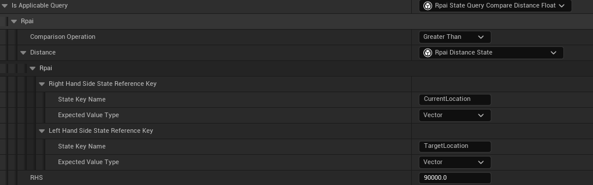

- For `Is in Desired State Query` select `Rpai State Query Compare Distance Float`. Select the arrow to the left to expand details if necessary, also expand the Rpai details if necessary. Configure these fields the same as the step above.
- For `Comparison Operation` select "Less Than Or Equal To"
- For `Distance` select `Rpai Distance State`. Select the arrow to the left to expand details if necessary, also expand the Rpai details if necessary
- For `Right Hand Side State Reference Key`, expand details and set `State Key Name` to "CurrentLocation" and `Expected Value Type` to "Vector"
- For `Left Hand Side State Reference Key`, expand details and set `State Key Name` to "TargetLocation" and `Expected Value Type` to "Vector"
- For `RHS` set the value to "90000.0" (this is 300.0 squared)

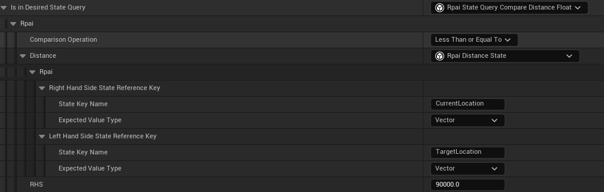

- Set the `Category` to 0 (this is the Highest Priority Group)
- Set the `Goal Name` to "TravelToTargetLocation".
- Add an Action by clicking the plus sign
- For `Weight Algorithm` select `Rpai Weight Distance`
- For `Distance` select `Rpai Distance State`. Select the arrow to the left to expand details if necessary, also expand the Rpai details if necessary
- For `Right Hand Side State Reference Key`, expand details and set `State Key Name` to "CurrentLocation" and `Expected Value Type` to "Vector"
- For `Left Hand Side State Reference Key`, expand details and set `State Key Name` to "TargetLocation" and `Expected Value Type` to "Vector"

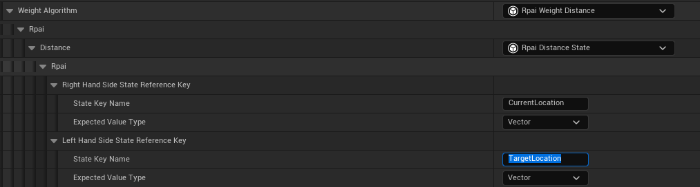

- For `Action Task` select `Rpai Action Task Move To`. Select the arrow to the left to expand details if necessary, also expand the Rpai details if necessary
- Change `Action Task State Key Value Reference` by setting `State Key Name` to "TargetLocation".


- For `Apply to State Mutators`, press the plus icon to add a new element and expand using the dropdown arrow on the left side, then expand `Index [ 0 ]` in the same manner as before.
- For the element select `Rpai State Mutator Copy State`. Select the arrow to the left to expand details if necessary, also expand the Rpai details if necessary.
- Expand `State Property to Copy` and set `State Key Name` to "TargetLocation" and `Expected Value Type` to "Vector"
- Expand `State Property to Mutate` and set `State Key Name` to "CurrentLocation" and `Expected Value Type` to "Vector"

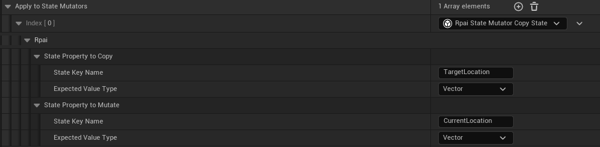

> Keep in Mind: The action mutators only have an impact in the hueristics of planning an action plan. Do not think of this as actions happening over time in your game. Rather, consider the state of the AI after the action has fully completed. So for this tutorial, when the action is completed, the AI agent will be at the location of "TargetLocation" (or at least near it). Do not try to make everything exact, fuzzy values work best here.

- For `Is Applicable Query` set the value to `Rpai State Query Every`.

> Note: An empty `Rpai State Query Every` is equivalent to an Always True configuration. An empty `Rpai State Query Any` is equivalent to an Always False configuration.

- Set the `Action Name` to "WalkToTargetLocation"
- Save and close your new behavior data asset

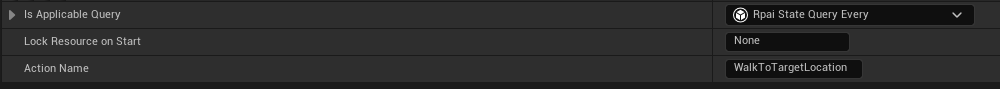

- Create a child class of `RpaiComposerBrainComponent`.

> Important Note: At this state the generation of current state does occur in code or Blueprints. This is a temporary stop gap and will be data driven in the future.

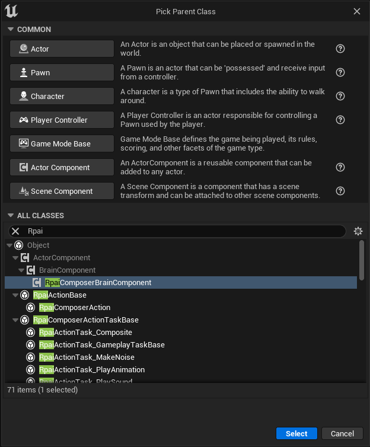

- Open your newly created Blueprint Class
- Hover over Functions and select Override and `Set State from Ai`

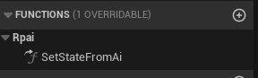

- Configure the function definition as pictured below

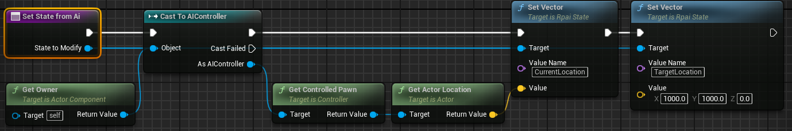

- In the "Event Graph" call `Start Logic` in the `Event Begin Play` node.

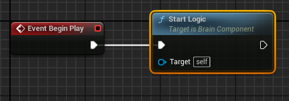

- In the Details panel for your component, expand the `Rpai` section and set the `Reasonable Planning Behavior` field to your newly created `RpaiComposerBehavior` data asset.
- Create a new AIController child class.
- Add your newly created Brain Component as a component to the newly created AIController class.
- Create a new Character Blueprint.
- Set the AI Controller class for your new Character Blueprint to your newly created AIController class.
- Set the SkeletalMeshComponent Mesh to the Mannequin Mesh
- Set the Animation to Use Anim Blueprint and select the Third Person Anim Blueprint (if not already configured)
- Place your new AI Character in the World and Press "Play" or "Simulate" (Alt+S on Windows)

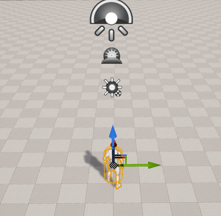

- Marvel and your AI walks to the defined "TargetLocation"!
- Now go out there and create some fascinating AI and shared it on the [Troll Purse Discord](https://discord.com/invite/TGhNfHtS) in the *#trollpurse-oss* channel!


## Design Patterns

Porting Utility AI design patterns to Goal selection in Reasonable Planning AI as based on the reasearch found in [neu.edu](https://course.ccs.neu.edu/cs5150f13/readings/dill_designpatterns.pdf).
Since planning uses a lot of the same structures, one may also consider adding these patterns to the actions for planning. All of the patterns referenced are the same as described in the referenced whitepaper.

### Utility Patterns

#### Opt Out Pattern

The opt out pattern is a means to signal a consideration for a goal must not be considered regardless of utility. To accomplish this pattern assign a `StateQuery` to the `IsApplicable` array as those return boolean results. To utilize the concept of a logical and, use the `StateQuery_Every`.

#### Opt In

The opt in pattern can be included by using an `RpaiWeight_Select` in the `Weight` configuration. This allows the concept of "only one of those reasons needs to be true in order for the option to be valid." Additionally, it can also be implemented by using a `StateQuery_Any` within the `IsApplicable` configuration.

### Execution History Patterns

#### Commit

Apply a state variable specific to the action. Then in the `StateMutator` amplify a float value that will be applied to a `UWeight_CurveFloat` that returns a reducing weight value as the float value increases. Use a polynomial to settle down the commitment after repeated uses.

#### Inertia

Use a `UWeight_CurveFloat` on your goal. Set a float value within your state that changes over time. Have a shorter plan of actions for the goal.

#### Is Done

Many answers to follow this design pattern. One can use a boolean toggle on the state and use a combination of `StateMutator` and `StateQuery` within `IsApplicable`. However that is not a scalable soution and couples many actions with each other via state properties. Rather, just consider how goals and actions are weighed and distance is determined and this will be accomplished via careful planning.

#### Cooldown

There is no concept of time natively built into the framework. One could implement this by using a float state value and a history to determine last time a goal was chosen. This is only in consideration of heuristics. `ActionTask_Wait` can implement this as part of a `ActionTask_Sequence`.

#### Do Once

Use a boolean value on the state and an `IsApplicable` `StateQuery` to test for this value. Once entered, set to false and the Goal or Action will not be considered.

#### One-Time Bonus

A weight based on a depreciating float value on the state can accomplish this pattern.

#### Repeat Penalty

A combination of an incrementing integer on the state and a curve can accomplish this.

## Integrating Smart Objects (Or Any AITask)

Because Reasonable Planning AI was built with flexibilty in mind and parity with the features offered by Behavior Trees, AITasks are a natural integration supported by the Reasonable Planning AI Composer Action Task class. To add an AI Task Action Task to Reasonable Planning AI, simple extend from the parent class `RpaiActionTask_GameplayTaskBase`. Here is an example in Unreal Engine 5 (UE5) on how to add the [Smart Objects Module](https://docs.unrealengine.com/5.0/en-US/smart-objects-in-unreal-engine---overview/) to your game using Reasonable Planning AI.

First, follow the instructions in the above link to active Smart Objects in your project. In your Build.cs file add the "SmartObjectModule" (if you haven't already) as a Build Dependency. Then create a C++ class similar to what is defined below.

### Header Definition
```C++
#pragma once

#include "CoreMinimal.h"
#include "AI/AITask_UseSmartObject.h"
#include "Composer/ActionTasks/RpaiActionTask_GameplayTaskBase.h"
#include "MyActionTask_WalkToUseSmartObject.generated.h"

/**
 * Navigate to and Use a Smart Object
 */
UCLASS()
class MY_API UMyActionTask_WalkToUseSmartObject : public URpaiActionTask_GameplayTaskBase
{
	GENERATED_BODY()
	
protected:
	virtual void ReceiveStartActionTask_Implementation(AAIController* ActionInstigator, URpaiState* CurrentState, AActor* ActionTargetActor, UWorld* ActionWorld) override;

	UPROPERTY(EditAnywhere, Category = SmartObjects)
	FGameplayTagQuery ActivityRequirements;

	UPROPERTY(EditAnywhere, Category = SmartObjects)
	float Radius;
};
```

### Source Implementation
```C++
#include "ActionTask_WalkToUseSmartObject.h"
#include "AI/AITask_UseSmartObject.h"
#include "AIController.h"
#include "GameplayTagAssetInterface.h"
#include "SmartObjectSubsystem.h"
#include "SmartObjectDefinition.h"

void UMyActionTask_WalkToUseSmartObject::ReceiveStartActionTask_Implementation(AAIController* ActionInstigator, URpaiState* CurrentState, AActor* ActionTargetActor = nullptr, UWorld* ActionWorld = nullptr)
{
	USmartObjectSubsystem* SOSubsystem = USmartObjectSubsystem::GetCurrent(ActionWorld);
	if (!SOSubsystem)
	{
		CancelActionTask(ActionInstigator, CurrentState, ActionTargetActor, ActionWorld);
	}
	
	if (auto AIPawn = ActionInstigator->GetPawn())
	{
		FSmartObjectRequestFilter Filter(ActivityRequirements);
		Filter.BehaviorDefinitionClass = USmartObjectGameplayBehaviorDefinition::StaticClass();
		if (const IGameplayTagAssetInterface* TagsSource = Cast<const IGameplayTagAssetInterface>(AIPawn))
		{
			TagsSource->GetOwnedGameplayTags(Filter.UserTags);
		}

		auto Location = AIPawn->GetActorLocation();
		FSmartObjectRequest Request(FBox(Location, Location).ExpandBy(FVector(Radius), FVector(Radius)), Filter);
		TArray<FSmartObjectRequestResult> Results;
		if (SOSubsystem->FindSmartObjects(Request, Results))
		{
			for (const auto& Result : Results)
			{
				auto ClaimHandle = SOSubsystem->Claim(Result);
				if (ClaimHandle.IsValid())
				{
					if (auto SOTask = UAITask::NewAITask<UAITask_UseSmartObject>(*ActionInstigator, *this))
					{
						SOTask->SetClaimHandle(ClaimHandle);
						SOTask->ReadyForActivation();
						StartTask(CurrentState, SOTask);
						return;
					}
				}
			}
		}
	}
	CancelActionTask(ActionInstigator, CurrentState, ActionTargetActor, ActionWorld);
}
```

